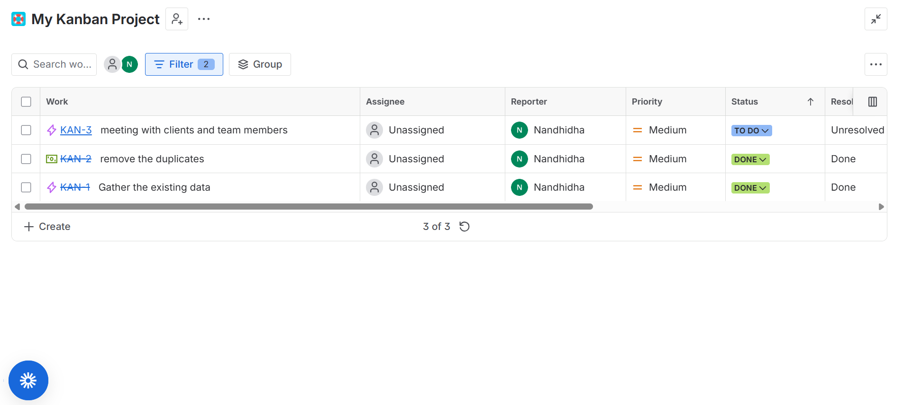

#jira-kanban-portfolio

Business Analyst portfolio project — Kanban workflow managed in Jira

Tool: Jira — Kanban board, backlog management, work item tracking

Role: Business Analyst — responsible for creating and organizing the backlog, assigning priority levels, tracking task status through the Kanban board, and monitoring project progress via the summary dashboard.

##Backlog
| ID | Task | Priority | Status |
|----|------|----------|--------|
| KAN-1 | Gather the existing data | Medium | Done |
| KAN-2 | Remove the duplicates | Medium | Done |
| KAN-3 | Meeting with clients and team members | Medium | To Do |

##Kanban Board

##Project Summary Dashboard

## What This Demonstrates
- Structuring a backlog with clear, actionable work items
- Tracking progress through a defined Kanban workflow
- Using dashboard reporting to monitor project health
